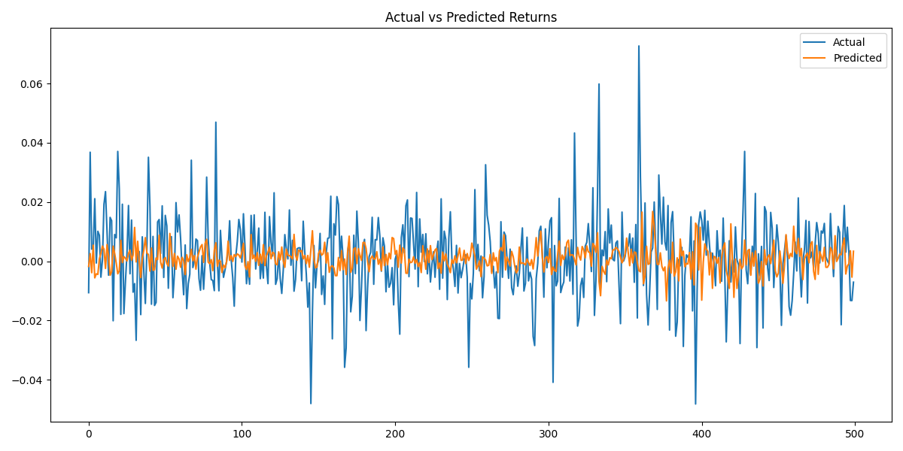
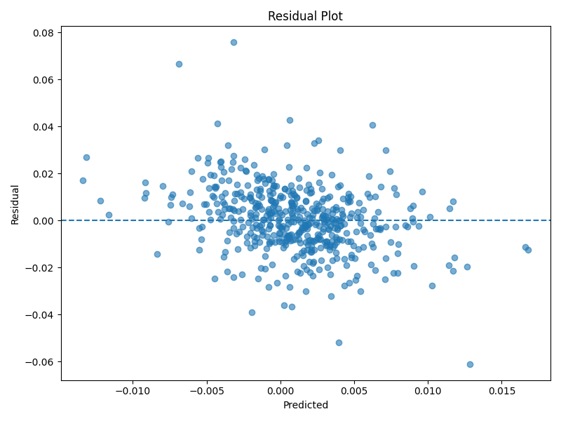
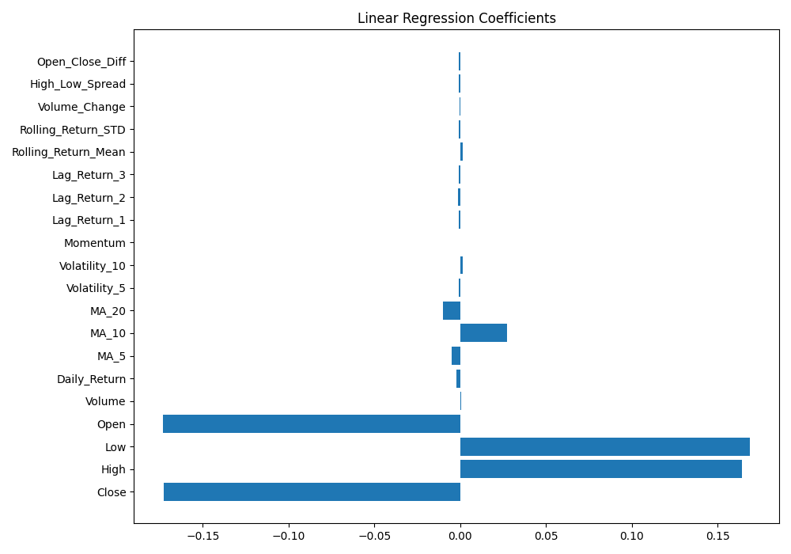

# 📈 Stock Return Prediction using Linear Regression

Predict the **next-day stock return** using historical stock market data and statistical feature engineering.

This project builds an end-to-end machine learning pipeline that downloads historical stock prices, engineers quantitative features, trains a Linear Regression model, and evaluates its predictive performance.

---

# 🎯 Why I Built It

Financial time series are noisy and difficult to predict.

The goal of this project was to understand the complete workflow of a quantitative research project:

- Collect market data
- Engineer predictive features
- Train a statistical model
- Evaluate predictive performance
- Analyze model limitations

Instead of predicting stock prices directly, this project predicts **next-day percentage returns**, which is a more common formulation in quantitative finance.

---

# 📊 Dataset

Source:
- Yahoo Finance (using `yfinance`)

Example stock:
- Apple (AAPL)

Period:
- 2015 – 2025

Frequency:
- Daily

Raw features:

- Open
- High
- Low
- Close
- Volume

---

# ⚙️ Feature Engineering

Engineered features include:

- Daily Return
- Moving Average (5, 10, 20 days)
- Rolling Volatility
- Momentum
- Lagged Returns
- Rolling Mean Return
- Rolling Standard Deviation
- Volume Change
- High-Low Spread
- Open-Close Difference

Target variable:

```
Tomorrow's Return
```

---

# 🤖 Model

Model used:

- Linear Regression

Training strategy:

- Chronological train-test split (80/20)
- StandardScaler for feature normalization
- No shuffling to preserve temporal order

---

# 📈 Results

Evaluation metrics:

| Metric | Value |
|---------|------:|
| MAE | 0.0082 |
| RMSE | 0.0114 |
| R² | 0.18 |

*(Replace with your actual results after running the project.)*

---

# 📷 Sample Outputs

## Actual vs Predicted



---

## Residual Plot



---

## Feature Coefficients



---

# 🚀 How to Run

Clone the repository

```bash
git clone https://github.com/<your-username>/Stock-Return-Prediction.git
```

Install dependencies

```bash
pip install -r requirements.txt
```

Run the complete pipeline

```bash
python main.py
```

---

# 📁 Project Structure

```text
src/
├── data_loader.py
├── preprocessing.py
├── feature_engineering.py
├── train.py
├── evaluate.py
├── visualization.py
└── utils.py
```

---

# 🛠 Technologies Used

- Python
- Pandas
- NumPy
- Scikit-learn
- Matplotlib
- yfinance
- Joblib

---

# ⚠️ Limitations

This project uses a simple Linear Regression model and therefore has several limitations:

- Assumes a linear relationship between engineered features and future returns.
- Does not incorporate macroeconomic indicators or company fundamentals.
- Ignores transaction costs, slippage, and market impact.
- Uses a single train-test split rather than walk-forward validation.
- Does not optimize a trading strategy or portfolio.

---

# 🚀 Future Improvements

- Ridge and Lasso Regression
- Random Forest Regressor
- XGBoost
- TimeSeriesSplit Cross Validation
- Walk-forward validation
- Technical indicators (RSI, MACD, Bollinger Bands)
- Multi-stock prediction
- Portfolio optimization

---

# 👨‍💻 Author

**Karthik Challagundla**

Final-year B.Tech Computer Science student with interests in:

- Quantitative Finance
- Statistics
- Machine Learning
- Algorithmic Trading